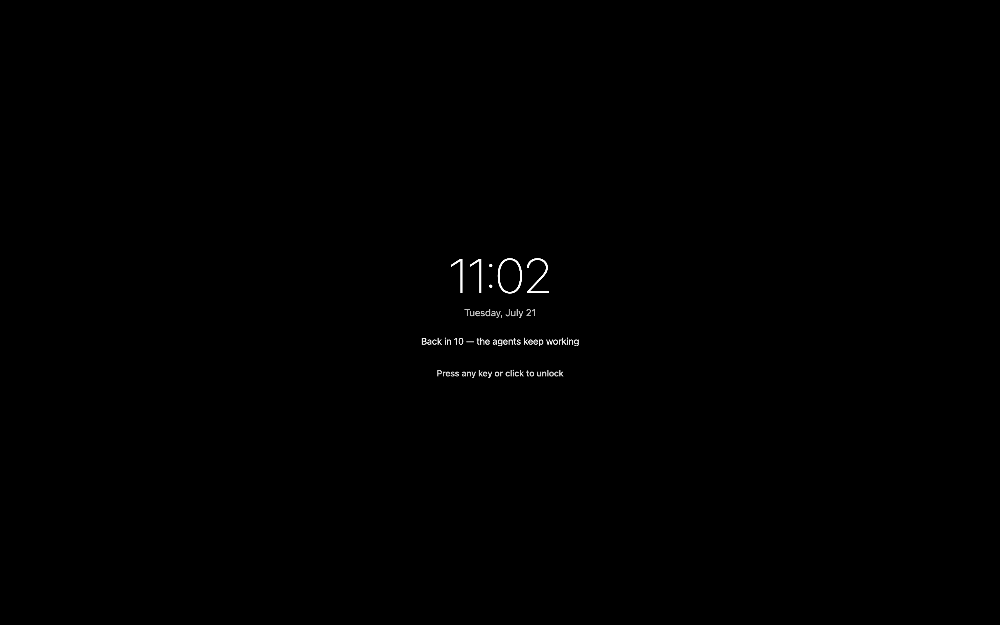
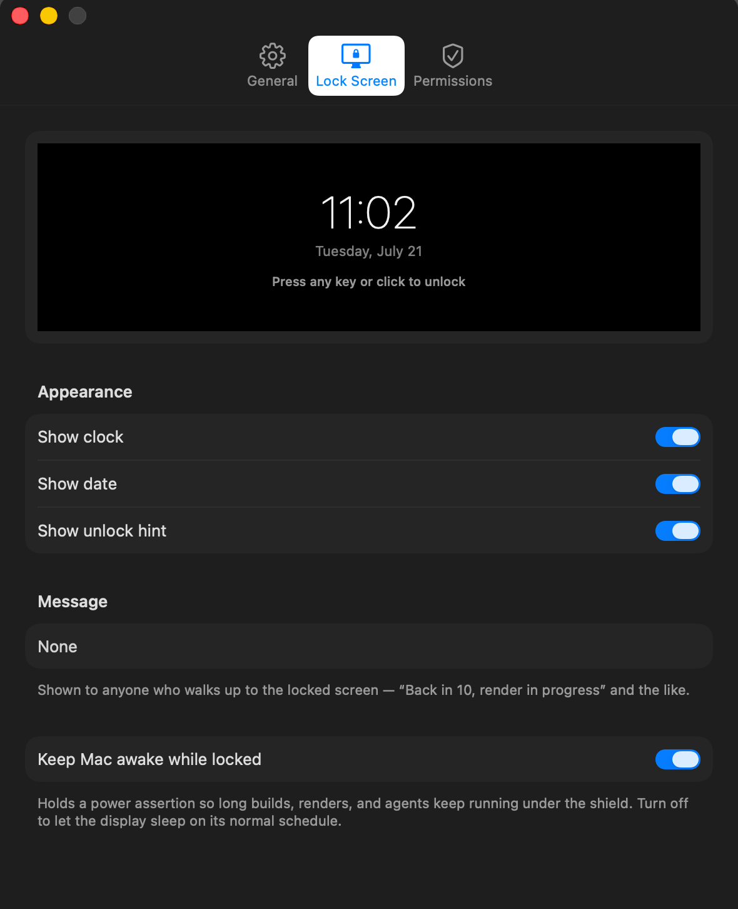

# Medusa 🐍

**Freeze every keyboard and mouse on your Mac with one shortcut. Unlock with Touch ID.**

<p align="center">
  <a href="https://github.com/rohmanhm/medusa/releases/latest"></a>
  
  
  
</p>

<p align="center">
  
</p>

Medusa is an open-source macOS menu-bar utility that blocks all keyboard,
mouse, and trackpad input while keeping your Mac awake and the screen visible —
so long-running work (AI coding agents, builds, renders, model training) keeps
going untouched while you step away. Unlock with Touch ID, Apple Watch, or your
login password.

> **Medusa is an input shield, not a security boundary.** It stops someone from
> *fiddling* with your Mac while you're nearby. It does **not** replace locking
> your screen (`⌃⌘Q`) for real security — see [Escape hatches](#escape-hatches).

## Features

- **System-wide input lock** — keyboard and scroll are swallowed at the
  event-tap level before any app sees them; mouse clicks land harmlessly on the
  full-screen shield (never swallowed, so the unlock dialog and every OS escape
  stay clickable).
- **Touch ID / Apple Watch / password unlock** — press any key or click, then
  authenticate.
- **Can't trap you** — a canceled unlock always lets you try again, a wedged
  auth dialog fails open, and an absolute backstop releases the lock no matter
  what. Force-shutdown is never the only way out.
- **All displays** — every screen is covered, and overlays follow monitor
  hot-plug and resolution changes.
- **Stays awake** — an IOKit power assertion keeps the display on and prevents
  idle sleep so your tasks don't pause (toggleable).
- **OLED-friendly** — the lock display wanders to a new spot every couple of
  minutes (or drifts gently, your pick) and dims to half brightness after a few
  idle minutes, so hours under the shield never park static pixels on your
  panel. A brief note on lock confirms what's on. Motion style and dim timing
  are adjustable in Settings → Lock Screen.
- **Global hotkey** — ⌘⇧L by default, recordable to any chord in Settings.
- **Auto-updates** — Medusa checks for new releases daily and updates itself
  in place (Sparkle 2, EdDSA-signed feed); "Check for Updates…" lives in the
  menu, and the toggle in Settings → General. Updates never interrupt an
  engaged lock.
- **Configurable lock screen** — clock, date, unlock hint, or a custom message
  for passers-by, with a live preview in a native Settings window (menu bar →
  **Settings…**, or ⌘,) that also covers launch-at-login, the shortcut, and the
  fail-safe auto-unlock horizon.
- **Menu-bar only** — no Dock icon, no clutter.

<p align="center">
  
</p>

## Getting started

You need macOS 13 or later (developed and tested on macOS 26). Touch ID drives
the biometric unlock; password unlock works on any Mac.

### Option 1 — download the app (Apple Silicon)

**[⬇ Download Medusa-0.2.3.dmg](https://github.com/rohmanhm/medusa/releases/download/v0.2.3/Medusa-0.2.3.dmg)**
— or grab the newest build from the [releases page](https://github.com/rohmanhm/medusa/releases/latest).

Open the DMG and drag **Medusa** into **Applications**, then launch it.
Releases are signed with a Developer ID certificate and notarized by Apple,
so the app opens without any security warning. From 0.2.0 on, Medusa keeps
itself up to date — on a 0.1.x build, grab this release manually once and
you're on the update train.

> Each release also carries a zip (it feeds the auto-updater). If you install
> from the zip manually, **unzip by double-clicking it in Finder** — some
> third-party extractors break the symlinks inside the bundled Sparkle
> framework, corrupting the code signature, and macOS then refuses the app
> with a scary "could not verify … free of malware" dialog. The DMG has no
> extraction step, which is why it's the recommended download.

The download is built for Apple Silicon. On an Intel Mac, build from source —
it's one command:

### Option 2 — build from source

```bash
./scripts/build-app.sh          # builds build/Medusa Local.app (ad-hoc signed)
open "build/Medusa Local.app"
```

Local builds ship as **Medusa Local** (`org.medusa.Medusa.local`) so their
Accessibility / Input Monitoring grants stay separate from a release install
in System Settings → Privacy. Release artifacts (via `scripts/release.sh`)
still ship as plain **Medusa**.

### First launch

On first launch Medusa opens **Settings → Permissions** and asks for two
permissions — both are required for an input-blocking app, and macOS makes you
grant them explicitly:

| Permission | Why Medusa needs it |
| --- | --- |
| **Accessibility** | To block (swallow) keyboard and mouse events. |
| **Input Monitoring** | To observe the input stream it blocks. |

Click **Open Settings…** on each row, toggle **Medusa** on, and the pane
updates automatically. Then press **⌘⇧L** to lock.

> **Dev note:** ad-hoc-signed builds get a new code signature hash on every
> rebuild, so macOS may ask you to re-grant the two permissions after
> `build-app.sh`. To avoid re-granting during development, sign with a stable
> self-signed identity or a Developer ID (see [Distribution](#distribution)).

## Using it

1. **Lock:** press **⌘⇧L**, or click the menu-bar icon → **Lock Now**. The
   screen goes black on every display with a clock and an unlock hint (both
   customizable — add your own "back in 10" message in Settings → Lock Screen).
2. **Unlock:** press any key or click anywhere → authenticate with Touch ID,
   Apple Watch, or your password.

## Verifying it works

Four command-line modes let you confirm the lock end-to-end without guessing
(installed the download? use `/Applications/Medusa.app` instead of
`build/Medusa.app`):

```bash
# Mechanics check — tap, overlay, keep-awake. Tears down in ~1s, never holds input.
build/Medusa.app/Contents/MacOS/Medusa --self-test

# Watcher — waits for the permissions and auto-runs the mechanics check the
# instant you grant them. Handy on first setup: start it, then flip the toggles.
build/Medusa.app/Contents/MacOS/Medusa --verify

# Real timed lock — genuinely blocks input, then auto-releases after N seconds
# (default 8) with NO authentication required. The safe way to feel the lock.
build/Medusa.app/Contents/MacOS/Medusa --lock-test 8

# Real unlock flow — a genuine lock that runs the Touch ID / password dialog so
# you can exercise CANCEL-then-retry, backed by a hard backstop that
# force-releases after N seconds (default 25) no matter what. This is the path
# --lock-test never touches: the auth cancel that used to trap the machine.
build/Medusa.app/Contents/MacOS/Medusa --auth-test 25
```

`--self-test` prints a per-piece pass/fail report; it will report the event tap
as blocked until you grant both permissions, then flip to PASS. `--lock-test` is
the safe end-to-end proof of the actual input block — it always releases itself,
so it can't trap the machine. `--auth-test` is the safe way to prove the *unlock*
path: raise the real dialog, cancel it, confirm it comes back, and trust the
backstop to release you if anything wedges.

## Escape hatches

Medusa is built so it can never hold your machine hostage. Recovery is layered,
from "just works" to "last resort":

1. **Try again** — canceling the unlock dialog always re-arms; touch input again
   and the dialog comes back (Medusa re-activates itself so it reliably
   re-appears even as a background menu-bar app). A stuck in-flight auth is
   cleared on sleep/wake so a cancel can never leave the cue dead.
2. **Fail open on a wedge** — if the system can't present the auth dialog at all
   (not merely a user cancel), Medusa releases rather than trap you. Repeated
   system-side auth failures release too.
3. **System unlock releases Medusa** — if you power-button into macOS's own lock
   screen and authenticate there, Medusa honors that unlock and drops its
   shield. It will not reappear on top of a session you already paid for.
4. **Backstop auto-release** — an absolute dead-man's-switch lifts the lock
   after 4 hours no matter what (configurable in Settings → General, from
   15 minutes to never). It rarely fires, because Touch ID lifts the lock in
   seconds — it's the guarantee that force-shutdown is never required.

Because mouse clicks are **never** swallowed, macOS's own reserved escapes stay
usable as well:

- **⌘⌥⎋ (Force Quit)** — the Force Quit window stays clickable; force-quit
  Medusa and input returns instantly.
- **Power button / Touch ID sensor** — wired to the Secure Enclave, never part
  of the event stream. Power-button → system lock → system unlock also releases
  Medusa (see above).
- **SSH from another machine** — `pkill -f Medusa.app` kills it remotely.

Medusa is honest about being an input shield rather than a lock-screen
replacement — but unlike a raw event-tap locker, it will not strand you.

## How it works

| Piece | Implementation |
| --- | --- |
| Input blocking | Active session-level `CGEventTap` (head-insert) that returns `nil` to swallow keyboard + scroll. Mouse events always pass through — the shield window absorbs the click. |
| Unlock under lock | Touch ID never touches the event stream; password typing bypasses the tap via macOS Secure Event Input; mouse is always live so the dialog stays clickable. |
| Lock screen | One borderless `NSWindow` per display at `CGShieldingWindowLevel()`, dropped to the screen-saver level during auth so the system dialog shows on top. |
| Stay awake | `IOPMAssertionCreateWithName` with `PreventUserIdleDisplaySleep`. |
| Never trap | The unlock flow classifies every `LAError`: user cancels re-arm (so a bystander can't pop the lock), but a dialog the system can't present fails open. A system-lock unlock (`com.apple.screenIsUnlocked`) releases Medusa. A 4-hour backstop timer force-releases as a last resort. |
| Reliability | The tap re-enables itself on `tapDisabledByTimeout`/`ByUserInput`, backed by a 1 s watchdog; if the tap can't be created, Medusa **fails open** and never shows a shield that isn't blocking. |

The design decisions and the research behind them live under
[`.scratch/v1-spec/`](.scratch/v1-spec/).

## Distribution

The [releases page](https://github.com/rohmanhm/medusa/releases) ships a
stapled DMG (the human download) and a zipped `Medusa.app` (the updater
enclosure), both Developer ID-signed and notarized by
[`scripts/release.sh`](scripts/release.sh). Installed apps update themselves
through a [Sparkle 2](https://sparkle-project.org) feed —
[`appcast.xml`](appcast.xml) in this repo, each release EdDSA-signed by
[`scripts/update-appcast.sh`](scripts/update-appcast.sh). Local `build-app.sh`
builds are ad-hoc signed and never self-update. A Homebrew cask and CI-driven
releases are planned — the research is in
[`.scratch/v1-spec/research/04-distribution.md`](.scratch/v1-spec/research/04-distribution.md).

## License

[MIT](LICENSE).
